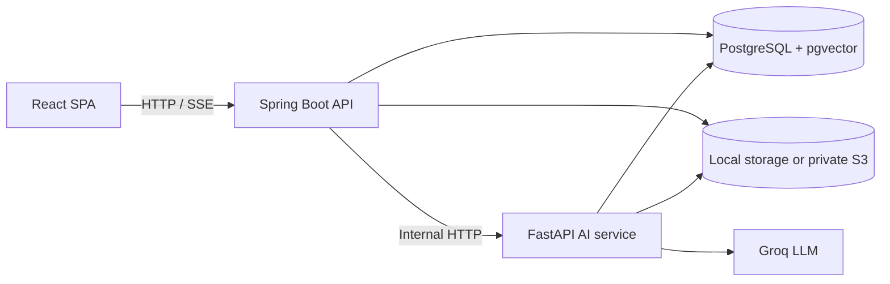
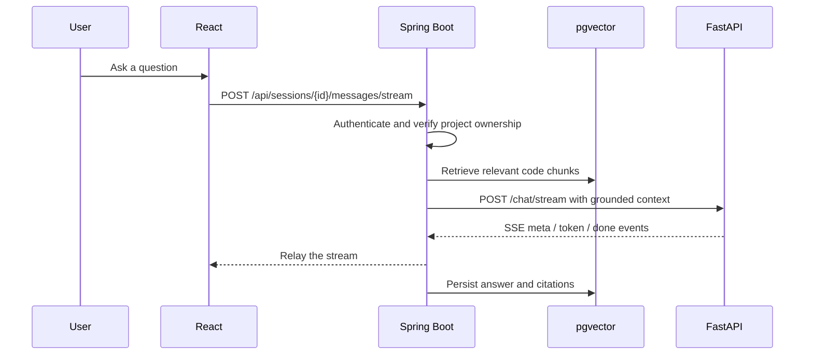

<div align="center">

# codebase-ai

**Ask questions of a codebase, then show your work.**

Upload a repository as a ZIP, search it semantically, and chat with answers
grounded in real file and line citations.

[](https://github.com/omnavneet/codebase-ai/actions/workflows/ci.yml)


[Features](#features) · [Architecture](#architecture) · [Quick start](#quick-start) · [Configuration](#configuration) · [Testing](#testing)

</div>

---

## Why this project

Most code-chat demos stop at a prompt and a response. This one keeps the whole path
inspectable: files are indexed, retrieval returns source locations, agent tools are
scoped to a single project, and the backend owns authentication, authorization, and
chat persistence.

## Features

| | |
| --- | --- |
| **Understand** | ZIP ingestion, language-aware chunking, embeddings, pgvector search |
| **Answer** | Streaming chat with file and line citations, plus conversation history |
| **Investigate** | Semantic search, file reading, dependency inspection, symbol and call-graph analysis |
| **Review** | Deterministic code review with LLM-assisted explanations |
| **Generate** | Documentation and README artefacts, stored separately from source files |
| **Protect** | JWT sessions, rotating refresh cookies, email verification, ownership checks, path-traversal guards |

## Architecture



| Service | Responsibility | Local URL |
| --- | --- | --- |
| `frontend/` | React 19, TypeScript, Vite, browser UX | `http://localhost:5173` |
| `backend/` | Auth, project ownership, uploads, indexing, retrieval, chat | `http://localhost:8080` |
| `ai-service/` | Embeddings, LLM calls, SSE responses, agent tools, code review | `http://localhost:8000` |
| PostgreSQL | Users, projects, files, chunks, symbols, references, chat history | `localhost:5432` |

The browser talks **only** to the backend. The AI service is server-to-server and is
protected by an internal token.

<details>
<summary><b>How a question is answered</b></summary>



</details>

## Quick start

**Prerequisites:** JDK 17+, Docker, Node 20+, Python 3.10+, and a
[Groq API key](https://console.groq.com/).

Before the first run, create the two git-ignored config files described in
[Configuration](#configuration). Then start each piece:

```bash
# 1. Database (Postgres 16 + pgvector) and MailHog for verification emails
docker compose up -d

# 2. AI service → http://localhost:8000
cd ai-service
python -m venv venv
venv/bin/pip install -r requirements.txt     # Windows: venv\Scripts\pip
venv/bin/python main.py                      # Windows: venv\Scripts\python

# 3. Backend → http://localhost:8080
cd backend
./mvnw spring-boot:run                       # Windows: .\mvnw.cmd spring-boot:run

# 4. Frontend → http://localhost:5173
cd frontend
npm install
npm run dev
```

Verification emails are caught by MailHog at <http://localhost:8025>.

## Configuration

Both config files hold secrets, so they are **git-ignored** and a fresh clone must
create them. Environment variables override the matching property
(for example `SPRING_DATASOURCE_URL`).

### Backend: `backend/src/main/resources/application.properties`

A minimal local setup:

```properties
spring.datasource.url=jdbc:postgresql://localhost:5432/codebase_ai
spring.datasource.username=admin
spring.datasource.password=<your-dev-password>
spring.jpa.hibernate.ddl-auto=validate

app.jwt.secret=<random-string-of-32+-bytes>
app.upload.directory=./uploads
app.ai-service.url=http://localhost:8000
```

<details>
<summary><b>Full backend reference</b></summary>

| Key | Default | Notes |
| --- | --- | --- |
| `spring.datasource.url` | `jdbc:postgresql://localhost:5432/codebase_ai` | Must match `docker-compose.yml` |
| `spring.datasource.username` / `.password` | `admin` / dev password | Use env vars in production |
| `spring.jpa.hibernate.ddl-auto` | `validate` | Flyway owns the schema, so keep this as `validate` |
| `spring.flyway.enabled` / `.locations` | `true` / `classpath:db/migration` | |
| `server.port` | `8080` | |
| `app.jwt.secret` | dev string | **Must** be a private, random 32+ byte value in production |
| `app.jwt.access-token-validity-ms` | `900000` (15 min) | |
| `app.jwt.refresh-token-validity-ms` | `604800000` (7 days) | Also sets the refresh cookie lifetime |
| `app.upload.directory` | `./uploads` | Must be writable; the AI service needs to read it |
| `app.storage.provider` | `local` | `local` stores projects under `<upload-dir>/<projectId>/`. `s3` stores nothing locally (everything lives under `s3://<bucket>/<prefix>/<projectId>/`), so the AI service needs bucket access instead of `UPLOAD_DIR` |
| `app.s3.bucket` | empty | Required when the provider is `s3`; startup fails without it |
| `app.s3.prefix` | `projects` | Key prefix inside the bucket, and the natural scope for an IAM policy |
| `app.s3.region` | empty | Blank falls back to the AWS default region chain (`AWS_REGION`). Credentials always come from the default provider chain (the ECS task role in production), so no access keys live in config |
| `app.ai-service.url` | `http://localhost:8000` | |
| `spring.servlet.multipart.max-file-size` / `.max-request-size` | `50MB` | Keep in sync with the frontend upload check |
| `app.cookie.secure` | `false` | **Set to `true`** whenever the app is served over HTTPS |
| `spring.mail.host` / `.port` | `localhost` / `1025` | MailHog locally; `mailhog:1025` inside Compose; a real SMTP host in production via `SPRING_MAIL_*` |
| `spring.mail.properties.mail.smtp.auth` / `.starttls.enable` | `false` / `false` | **Set both to `true`** for a production provider |
| `app.public-url` | `http://localhost:5173` | Public SPA URL used to build verification links (`http://localhost:3000` in Compose) |
| `app.mail.from` | `no-reply@codebase-ai.local` | Sender address; providers such as SES require a verified `from` |
| `app.verification.token-ttl-hours` | `24` | Lifetime of a verification link |
| `app.verification.resend-cooldown-seconds` | `60` | Minimum gap between verification emails for one address |

</details>

### AI service: `ai-service/.env`

| Key | Required | Notes |
| --- | :---: | --- |
| `GROQ_API_KEY` | ✅ | Your Groq API key |
| `LLM_MODEL` | ✅ | For example `openai/gpt-oss-20b` |
| `DB_HOST`, `DB_PORT`, `DB_NAME`, `DB_USER`, `DB_PASSWORD` | ✅ | The agent reads chunks directly from pgvector |
| `UPLOAD_DIR` | ✅ (local storage) | Absolute path to the backend upload directory (`backend/uploads`), used by the file tools |
| `EMBEDDING_MODEL` | | Defaults to `all-MiniLM-L6-v2`. Must stay 384-dimensional to match `chunks.embedding vector(384)` |

## Security

- **Email verification.** Registration creates an *unverified* account and mails a
  single-use link. No access or refresh token is issued until it is opened.
  `VerifiedUserFilter` re-checks verification on every data-creating or AI endpoint
  (project creation, ZIP upload, search, docs export, chat, and all agent tools).
- **Safe verification tokens.** Only the SHA-256 hash of a token is stored, tokens are
  never logged, and links point at the SPA route `/auth/verify-email` rather than the
  API, so mail scanners that prefetch links cannot consume them.
- **No account probing.** `resend-verification` always answers identically, so it
  cannot be used to discover which addresses exist.
- **Scoped access.** Ownership is checked on every project request, agent tools are
  limited to a single project, and file access is guarded against path traversal.

| Endpoint | Behaviour |
| --- | --- |
| `POST /api/auth/register` | Creates the account, mails the link, returns `{ message, email }` (no session) |
| `GET /api/auth/verify-email?token=...` | Consumes the token (single use, 24 h TTL) and marks the account verified |
| `POST /api/auth/resend-verification` | Mails a fresh link and invalidates the old one |

**Going to production?** Set `SPRING_MAIL_HOST`, `SPRING_MAIL_PORT`,
`SPRING_MAIL_USERNAME`, `SPRING_MAIL_PASSWORD`, `APP_MAIL_FROM` and `APP_PUBLIC_URL`;
enable SMTP auth and STARTTLS; set `app.cookie.secure=true`; use a strong
`app.jwt.secret`; and serve everything over HTTPS.

## Health check

`GET /api/health` is unauthenticated and built for load balancers and orchestrators
(ECS/ALB target groups, `docker compose --wait`). It runs a trivial `SELECT 1`:

| Database | Response |
| --- | --- |
| Reachable | `200 {"status":"UP","database":"UP"}` |
| Unreachable | `503 {"status":"DOWN","database":"DOWN"}` |

A process that is up but cannot serve requests is never reported healthy. The endpoint
is available directly (`http://backend:8080/api/health`) and through the frontend's
nginx proxy (`http://<host>/api/health`).

## Testing

| Suite | Command |
| --- | --- |
| Backend | `cd backend && ./mvnw test` |
| AI service | `cd ai-service && python -m unittest discover -s . -p 'test_*.py'` |
| Frontend | `cd frontend && npm run build` (type-check + Vite build) |

The backend suite needs no database, SMTP server, or AWS credentials, and the S3 tests
use an in-memory client. The AI-service tests do the same.

**CI** (`.github/workflows/ci.yml`) runs all three suites, then a **compose smoke
test**: it brings up the full `docker-compose.prod.yml` stack with `--wait` and checks
that:

- the frontend serves the SPA shell,
- `/api/health` reports `UP` through the nginx proxy,
- the AI service `/health` responds, and
- Flyway migrations applied cleanly to a fresh database volume.