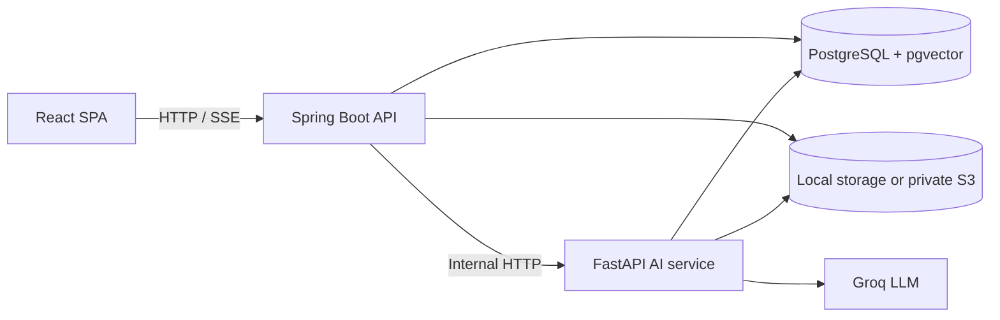

# codebase-ai

> **Ask questions of a codebase, then show your work.**

Upload a repository as a ZIP, search it semantically, inspect real files and symbols,
and chat with answers grounded in file and line citations. The project combines a
React client, a Spring Boot API, PostgreSQL with pgvector, and a private FastAPI AI
service with investigation and code-review tools.

[](https://github.com/omnavneet/codebase-ai/actions/workflows/ci.yml)


## Why this project

Most code chat demos stop at a prompt and a response. This one keeps the path
inspectable: files are indexed, retrieval returns source locations, agent tools are
scoped to a project, and the backend owns authentication, authorization, and chat
persistence.

## What it can do

| Area | Capability |
| --- | --- |
| **Understand** | ZIP ingestion, language-aware chunking, embeddings, pgvector search |
| **Answer** | Streaming chat with citations and conversation history |
| **Investigate** | Semantic search, file reading, dependency inspection, symbol and call-graph analysis |
| **Review** | Deterministic code review plus LLM-assisted explanations |
| **Generate** | Documentation and README artefacts stored separately from source files |
| **Protect** | JWT sessions, rotating refresh cookies, email verification, ownership checks, path-traversal guards |

## Architecture



### Request flow


### Service boundaries

| Service | Owns | Local entry point |
| --- | --- | --- |
| `frontend/` | React 19, TypeScript, Vite, browser UX | `http://localhost:5173` |
| `backend/` | Auth, project ownership, uploads, indexing, retrieval, chat | `http://localhost:8080` |
| `ai-service/` | Embeddings, LLM calls, SSE responses, agent tools, code review | `http://localhost:8000` |
| PostgreSQL | Users, projects, files, chunks, symbols, references, chat history | `localhost:5432` |

The browser talks only to the backend. The AI service is server-to-server and is
protected by an internal token.

## Health check

`GET /api/health` is unauthenticated and is what container orchestrators and load
balancers poll (ECS/ALB target-group health checks, `docker compose ... --wait`).
It runs a trivial `SELECT 1` and answers `200 {"status":"UP","database":"UP"}`, or
`503 {"status":"DOWN","database":"DOWN"}` when the database is unreachable — a
process that is up but cannot serve requests must not be reported healthy. It is
reachable both directly (`http://backend:8080/api/health`) and through the
frontend's nginx `/api` proxy (`http://<host>/api/health`).

## Prerequisites

* JDK 17+, Docker, Node 20+, Python 3.10+
* A Groq API key (`GROQ_API_KEY`)

## Running locally

```bash
# 1. Database (Postgres 16 with pgvector) + MailHog for verification emails.
#    MailHog web UI: http://localhost:8025
docker compose up -d

# 2. AI service  (http://localhost:8000)
cd ai-service
python -m venv venv
venv/Scripts/pip install -r requirements.txt      # Windows; use venv/bin/... on Unix
venv/Scripts/python main.py                        # or: venv/Scripts/uvicorn main:app --port 8000

# 3. Backend     (http://localhost:8080)
cd backend
./mvnw spring-boot:run                             # Windows: .\mvnw.cmd spring-boot:run

# 4. Frontend    (http://localhost:5173)
cd frontend
npm install
npm run dev
```

## Configuration

Both config files below are **git-ignored** (they hold secrets), so a fresh clone
must create them. Environment variables passed to the process override the
corresponding property (e.g. `SPRING_DATASOURCE_URL`).

### `backend/src/main/resources/application.properties`

| Key | Default | Notes |
| --- | --- | --- |
| `spring.datasource.url` | `jdbc:postgresql://localhost:5432/codebase_ai` | must match `docker-compose.yml` |
| `spring.datasource.username` / `.password` | `admin` / dev password | use env vars in production |
| `spring.jpa.hibernate.ddl-auto` | `validate` | schema is owned by Flyway, keep as `validate` |
| `spring.flyway.enabled` / `locations` | `true` / `classpath:db/migration` | |
| `server.port` | `8080` | |
| `app.jwt.secret` | dev string | **must** be a private, random 32+ byte value in production |
| `app.jwt.access-token-validity-ms` | `900000` (15 min) | |
| `app.jwt.refresh-token-validity-ms` | `604800000` (7 days) | also drives the refresh cookie lifetime |
| `app.upload.directory` | `./uploads` | must be writable; the AI service needs to read it |
| `app.storage.provider` | `local` | `local` keeps each project under `<app.upload.directory>/<projectId>/`; `s3` keeps nothing on the local filesystem (everything under `s3://<bucket>/<prefix>/<projectId>/`), so the ai-service file tools need bucket access instead of `UPLOAD_DIR` |
| `app.s3.bucket` | empty | required when `app.storage.provider=s3`; startup fails without it |
| `app.s3.prefix` | `projects` | key prefix inside the bucket, so one bucket can host other data; also the natural scope of the IAM policy |
| `app.s3.region` | empty | blank falls back to the AWS default region chain (`AWS_REGION`); credentials always come from the default provider chain (the ECS task role in production), so no access keys live in config |
| `app.ai-service.url` | `http://localhost:8000` | |
| `spring.servlet.multipart.max-file-size` / `.max-request-size` | `50MB` | keep in sync with the frontend upload check |
| `app.cookie.secure` | `false` | **set `true`** whenever the app is served over HTTPS |
| `spring.mail.host` / `.port` | `localhost` / `1025` | MailHog locally (`localhost` because the backend usually runs on the host); `mailhog:1025` inside Compose; a real SMTP host in production via `SPRING_MAIL_*` |
| `spring.mail.properties.mail.smtp.auth` / `.starttls.enable` | `false` / `false` | MailHog accepts plain SMTP; **set both `true`** for a production provider |
| `app.public-url` | `http://localhost:5173` | public SPA URL used to build verification links; `http://localhost:3000` in Compose |
| `app.mail.from` | `no-reply@codebase-ai.local` | sender address; providers such as SES require a verified `from` |
| `app.verification.token-ttl-hours` | `24` | lifetime of a verification link |
| `app.verification.resend-cooldown-seconds` | `60` | minimum gap between two verification emails for one address |

### `ai-service/.env`

| Key | Notes |
| --- | --- |
| `GROQ_API_KEY` | required |
| `LLM_MODEL` | required, e.g. `openai/gpt-oss-20b` |
| `DB_HOST`, `DB_PORT`, `DB_NAME`, `DB_USER`, `DB_PASSWORD` | the agent reads chunks directly from pgvector |
| `UPLOAD_DIR` | absolute path to the backend upload directory (`backend/uploads`) used by the file tools |
| `EMBEDDING_MODEL` | optional, default `all-MiniLM-L6-v2`; must stay 384-dimensional to match `chunks.embedding vector(384)` |

## Email verification

Registration creates the account **unverified** and mails a single-use link; no access
or refresh token is issued until that link is opened, so an unverified account cannot
reach any endpoint. The gate is re-checked on every data-creating or AI endpoint by
`VerifiedUserFilter` (project creation, ZIP upload, semantic search, docs export, chat
and all agent tools).

| Endpoint | Behaviour |
| --- | --- |
| `POST /api/auth/register` | creates the account, mails the link, returns `{ message, email }` (no session) |
| `GET /api/auth/verify-email?token=...` | consumes the token (single use, 24 h TTL), marks the account verified |
| `POST /api/auth/resend-verification` | mails a fresh link (invalidating the old one) and always answers identically, so it cannot be used to probe which addresses exist |

Locally every mail shows up in MailHog at http://localhost:8025. For production set
`SPRING_MAIL_HOST`, `SPRING_MAIL_PORT`, `SPRING_MAIL_USERNAME`,
`SPRING_MAIL_PASSWORD`, `APP_MAIL_FROM` and `APP_PUBLIC_URL`, turn on
`spring.mail.properties.mail.smtp.auth` + `.starttls.enable`, and serve the app over
HTTPS. Only the SHA-256 hash of a token is stored, tokens are never logged, and the
verification link points at the SPA route `/auth/verify-email` rather than at the API
so mail scanners that prefetch links cannot consume the token.

## Tests

`cd backend && ./mvnw test` runs the backend suite: `AuthServiceTest`,
`EmailVerificationServiceTest`, `MailServiceTest`, `VerifiedUserFilterTest`,
`HealthControllerTest`, `ZipExtractionServiceTest`, `SecretValidationConfigTest` and the
storage tests (`StoragePathsTest`, `LocalStorageServiceTest`, `S3StorageServiceTest`).
None of them need a database, an SMTP server or AWS credentials — the S3 client is a
hand-written proxy. `cd ai-service && python -m unittest discover -s . -p 'test_*.py'`
runs the AI-service unit tests (`test_core_safety.py` and `test_storage.py`), which
likewise use an injected in-memory S3 client, and `cd frontend && npm run build`
(`tsc -b` + Vite) is the frontend type-check/build.

CI (`.github/workflows/ci.yml`) runs those three suites and then a **compose smoke
test**: it writes a throwaway `.env`, brings up the full `docker-compose.prod.yml`
stack with `--wait`, and asserts the frontend serves the SPA shell, `/api/health`
reports `UP` through the nginx proxy, the AI service `/health` responds, and the
backend applied the Flyway migrations to a fresh database volume.
 
